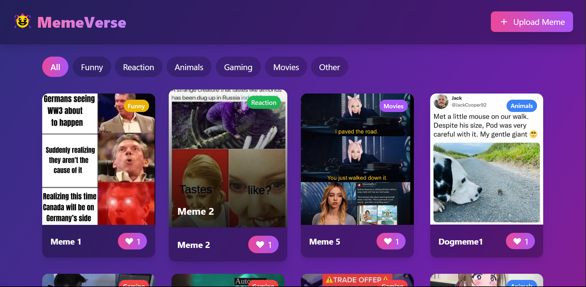

# 🤣 MemeVerse - A Modern Meme Sharing Platform

MemeVerse is a modern and responsive web application where users can:
- 🚀 Upload memes from their local system
- 🌐 View memes uploaded by other users
- ❤️ React with a clean and engaging UI

---

## 📸 Features

- ✅ Upload memes (image files from your computer)
- ✅ View all uploaded memes in a modern gallery format
- ✅ Responsive design (works on mobiles, tablets, and desktops)
- ✅ Like and view counts (optional for future upgrades)

---

## 🖼️ Screenshots

> 

---

## 🛠️ Tech Stack

- **Frontend:** Next js, CSS (Tailwind)
- **Backend** (optional):** Node.js + Express + MongoDB
- **File Storage (optional):** Local folder (for demo) 

---

## 🚀 Getting Started

### 1. Clone the Repository
```bash
git clone https://github.com/DigarSingh/memeverse.git
cd memeverse
2. Install Dependencies
If using backend:
```
```bash
npm install
```

### 3. Run the Application
## Frontend
Just open the index.html in your browser or use a Live Server extension.

Backend (if added)
```bash
node server.js
```
## ✨ Future Improvements
💬 Add comment and like system

🔐 User authentication (sign up / login)

📱 Progressive Web App (PWA) support

🎨 Dark mode toggle

## 🤝 Contributing
Contributions are welcome!
Feel free to open issues and submit pull requests.

## 🙌 Author
Made with ❤️ by Digar Singh
